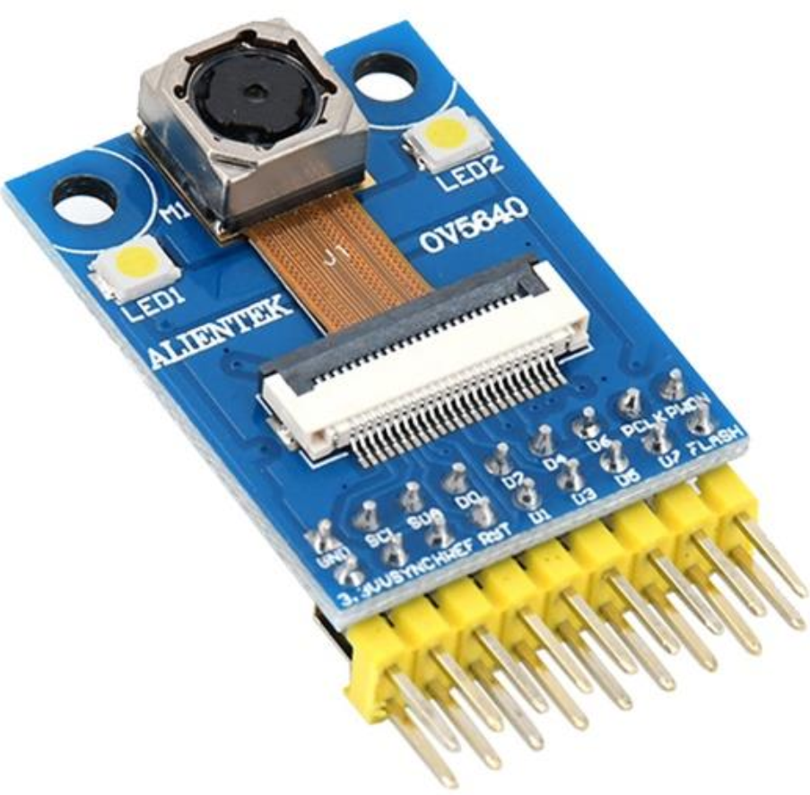
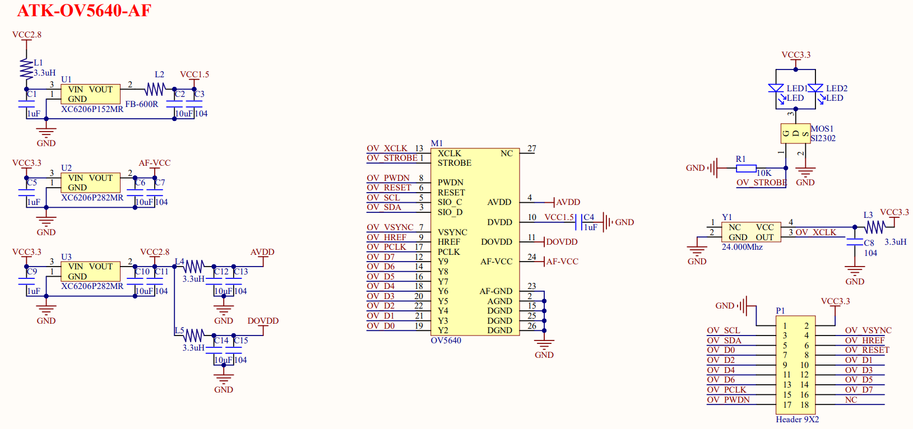

## 1 Introduction

### 1.1 Appearence

The ATK-MD5640 module looks like this:

### 1.2 Features

The ATK-MC5640 module is a high-performance 500W high-definition camera module launched by ALIENTEK. This module uses OmniVision's OV5640 camera sensor as the core, which is a 1/4-inch CMOS QSXGA (2592 * 1944) image sensor. At the same time, the ATK-MC5640 module integrates active crystal oscillators and LDO chips, as well as automatic focus (AF) function and two 1W high brightness LED flash lights, which have a very high cost performance ratio.

### 1.3 Parameter

Here are the product basic parameters:

| Parameter                   | Describe                                                     |
| --------------------------- | ------------------------------------------------------------ |
| Communication Interface     | Control interface: SCCB protocol (compatible with IIC protocol) Data interface: 8-bit data |
| Output Formats              | RawRGB RGB(GBR422,RGB565,RGB555) CCIR656 YUV422、YUV420 YCbCr422 JPEG |
| Output bit width            | 8-bit                                                        |
| Output Pixels               | QSXGA(2592*1944) and any size up to 40 * 30                  |
| Naximum image Transfer Rate | QSXGA:15fps 1080P:30fps 720P:60fps                   |
| Lens Size                   | 1/4 inch                                                     |
| Sensitivity                 | 600mV/Lux-sec                                                |
| S/N Ratio                   | 36dB                                                         |
| Dynamic Range               | 68dB                                                         |
| Lens aperture               | F2.8                                                         |
| Camera perspective          | 70°                                                          |
| focal length                | 3.34mm                                                       |
| Temperature Range           | -30℃~70℃                                                     |
| Module size                 | 24mm*32mm                                                    |

The electrical parameters are shown in the following table:

| Parameter         | Describe                  |
| ----------------- | ------------------------- |
| Supply voltage    | 3.3V                      |
| IO port level     | 2.8V,compatible with 3.3V |
| Power dissipation | 56mA                      |

### 1.4 Interface

The ATK-MC5640 module is connected to an external circuit through a 2 * 9 pin . The detailed description of each pin is shown in the table below.

| Number | Name  | Describe                            |
| ------ | ----- | ----------------------------------- |
| 1      | GND   | Power ground                        |
| 2      | 3V3   | 3V3 power supply                    |
| 3      | SCL   | SCCB serial interface clock input   |
| 4      | VSYNC | Vertical synchronization output     |
| 5      | SDA   | SCCB serial interface data I/O      |
| 6      | HREF  | Horizontal reference output         |
| 7      | D0    | Video port output bit[0]            |
| 8      | RESET | Reset OV2640                        |
| 9~14   | D1~D6 | Video port output bit[1:6]          |
| 15     | PCLK  | Pixel clock output                  |
| 16     | D7    | Video port output bit[7]            |
| 17     | PWDN  | Power-down mode enable, active high |
| 18     | NC    | NC                                  |

## 2 Schematic

The schematic diagram of the ATK-MD5640 module is shown as follows.

